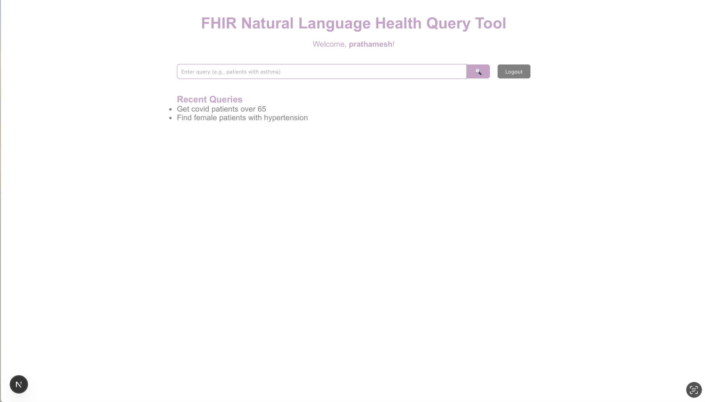
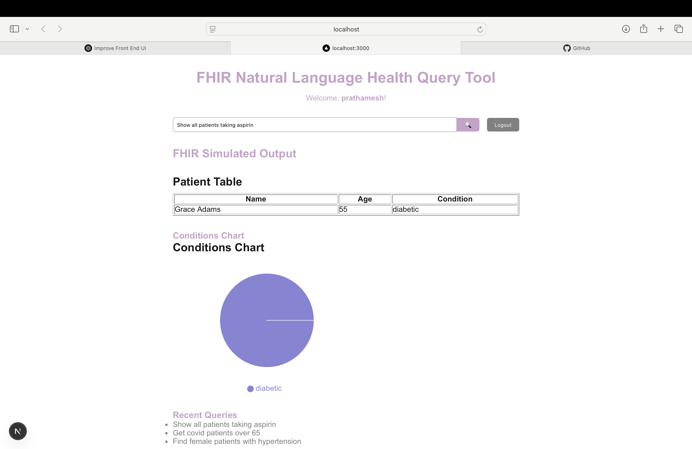
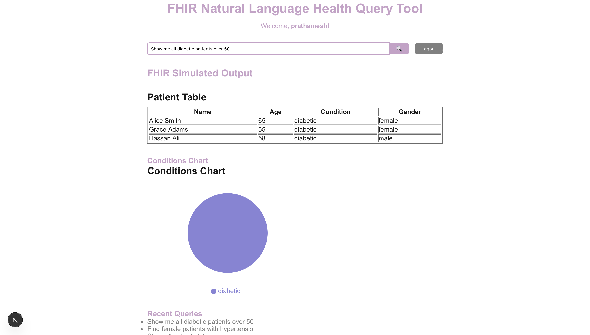
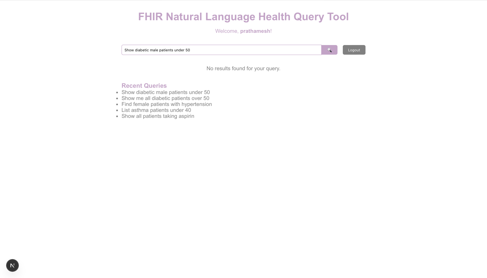

# 🧠 AI on FHIR – Natural Language Health Query System

This full-stack app converts natural language queries like  
“Show me all diabetic patients over 50”  
into structured, FHIR-style health data queries.

What is FHIR?
FHIR (Fast Healthcare Interoperability Resources) is a standard for structuring and exchanging healthcare data electronically. It breaks medical data into "resources" like Patient, Condition, Medication, etc.
---

## 🚀 Demo

🌐 Frontend: `http://localhost:3000`  
🔐 Backend: `http://localhost:5050`  
📥 JWT token is automatically stored on login. You can also manually add it to `localStorage` for testing.

---

## 📂 Project Structure

ai-on-fhir-assessment/
├── backend/               # Flask backend (Python)
│   ├── app.py             # Core API + NLP logic
│   ├── requirements.txt   # Backend dependencies
│   ├── Dockerfile         # Docker config
│   ├── .dockerignore      # Docker exclusions
│   ├── users.db           # SQLite for user auth
│   ├── test_*.py          # Backend tests
│
├── frontend/              # React frontend (Vite or Next.js)
│   ├── pages/index.js     # Main UI page
│   ├── components/        # Reusable components
│   ├── styles/            # Global CSS
│
├── security.md            # Security & compliance plan
├── Makefile               # Simplified CLI commands
└── README.md              # You're here!

---

## ✅ Features

- 🔐 JWT auth with registration & login  
- 🧠 NLP (spaCy + regex) to extract:
  - conditions (diabetes, asthma, etc.)
  - age filters (e.g., over 50)
  - gender (male/female)
  - medications  
- 🔄 Converts natural language into mock FHIR-style filters  
- 📊 React frontend with:
  - Input + result table + pie chart
  - No-results message handling
  - Query history (frontend only)
  - Logged-in username display
  - Auto-focus on input field  

---

## 🛠️ Running the Project

Make sure you’re in the root directory (`ai-on-fhir-assessment/`).

### 🔧 1. Setup Backend (only once)

```bash
make setup

Or manually:

cd backend
python3 -m venv venv
source venv/bin/activate
python app.py

cd frontend
npm run dev

pip install -r requirements.txt
python -m spacy download en_core_web_sm

▶️ 2. Start Backend
make backend

🌐 3. Start Frontend
make frontend

Then open http://localhost:3000

🔐 4. Login (Get JWT Token)
make login
Then paste the returned token in your browser's console:

localStorage.setItem("token", "PASTE_YOUR_TOKEN_HERE")
🐳 5. Run Backend in Docker (Optional)
make docker-backend
This:

Builds the backend Docker image
Runs the Flask app in a container on port 5050

## 🔍 Example Queries

| Input                                  | Parsed FHIR Filters                     |
|----------------------------------------|------------------------------------------|
| Show me all diabetic patients over 50  | condition: diabetic, age: >50            |
| List asthma patients under 40          | condition: asthma, age: <40              |
| Find female patients with hypertension | condition: hypertension, gender: female  |
| Show all patients taking aspirin       | medications: aspirin                     |
| Get covid patients over 65             | condition: covid, age: >65               |


## 🖼️ Screenshots

### 🔐 Login Screen


###  Dashboard


### 💬 Query & Result Display


### 💬 Query & Result Display


### ⚠️ No Results Handling



🔒 Security & Compliance

See security.md for:
JWT route protection
Planned SMART on FHIR + OAuth 2.0 integration
Minimal PII handling
Future audit logging and RBAC

✅ Deliverables

Auth system with protected /query route
NLP-powered backend that parses natural language into FHIR filters
Frontend UI with table/chart output
Query history + user personalization (frontend only)
Graceful no-results handling
Clean structure with setup + Docker instructions
Security documentation + requirements.txt for reproducibility

💡 Future Enhancements

More condition/symptom recognition
Backend test suite (pytest)
Multi-language input (i18n)
Query history (per-user, persistent)
Tailwind UI overhaul (planned)
Dockerized backend + deploy to Fly.io
Deploy frontend to Vercel for public demo
OAuth2 / SMART on FHIR login integration
